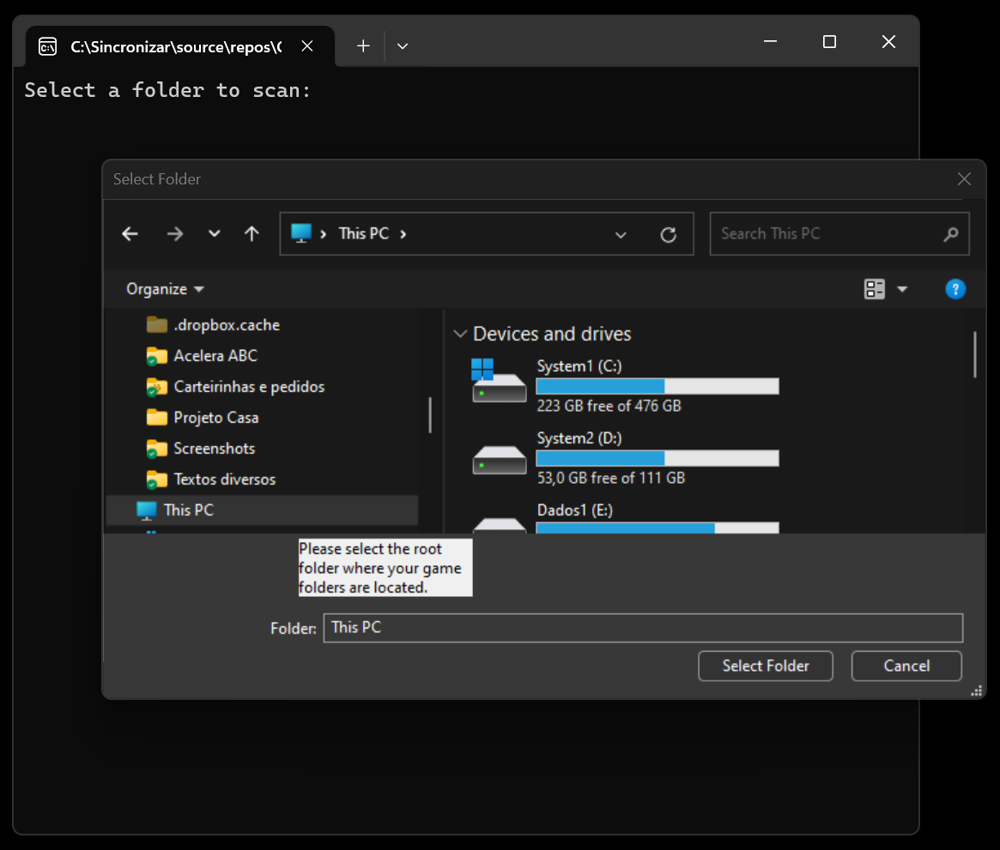
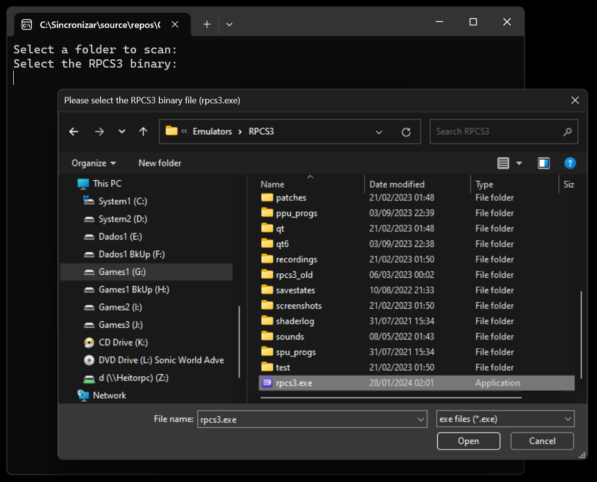
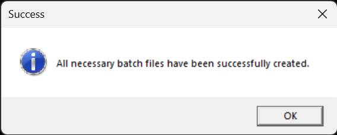

# PS3BatchLauncherCreator

A batch file creator for RPCS3 emulator.

## How it works

This utility creates batch files for PS3 games to easily launch them on the RPCS3 emulator.

The utility asks the user for the folder where you store all your PS3 game folders, then it asks for the location of the RPCS3 emulator.

It will also create batch files for every game folder inside the specified folder. It will create batch files for the game folders inside the RPCS3 emulator folder (RPCS3\dev_hdd0\game) as well.

The batch files will be saved inside the originally specified folder.

The application will automatically read the PARAM.SFO to extract the game TITLE. This TITLE will be used to name the created batch file.

To launch a game, you just need to double-click on the batch file.

This batch file can be called directly from any Emulator Launcher or Emulator Frontend, or even from Steam.

It was originally designed by the creator of the [Simple Launcher](https://github.com/drpetersonfernandes/SimpleLauncher) emulator frontend, but it can be used with any frontend or even without one.

## Bat File Examples

```bat
"G:\Emulators\RPCS3\rpcs3.exe" --no-gui "G:\Emulators\RPCS3\dev_hdd0\game\NPUB30024\USRDIR\EBOOT.BIN"
```

```bat
"G:\Emulators\RPCS3\rpcs3.exe" --no-gui "J:\Sony PS3 Roms\King of Fighters XIII, The (USA) (En,Ja,Fr,De,Es,It,Zh,Ko)\PS3_GAME\USRDIR\EBOOT.BIN"
```

## Screenshots







## Technical Details

It was written in C# using Microsoft Visual Studio Community 2022 (64-bit) with Microsoft .NET 8.0.

This program is Windows-only. Compatibility with Windows 7 and later versions is expected. It has been tested on Windows 11.

## Contributors

- **Peterson Fernandes** - [Github Profile](https://github.com/drpetersonfernandes)